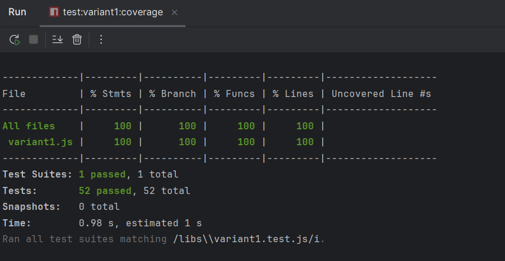

# Final Exam

> Final exam for checking student knowledge and practical skills

## Variant 1:

>  Using Jest a delightful JavaScript Testing Framework creata unit test for file in libs/variant1.js file

### Implementation

#### Created Files

1. **libs/variant1.test.js** - Comprehensive unit tests for all type-checking functions
2. **package.json** - Project configuration with Jest setup and ES modules support

#### Test Structure

The test suite covers 11 functions with 52 test cases:

- `isNumber()` - Tests for number type validation (2 test groups)
- `isBigNumber()` - Tests for BigNumber and Decimal object detection (7 tests)
- `isComplex()` - Tests for Complex number objects (5 tests)
- `isFraction()` - Tests for Fraction objects (5 tests)
- `isUnit()` - Tests for Unit objects with prototype checking (6 tests)
- `isString()` - Tests for string type validation (3 tests)
- `isArray()` - Tests using native Array.isArray (2 tests)
- `isMatrix()` - Tests for Matrix objects (5 tests)
- `isCollection()` - Tests for arrays and Matrix collections (4 tests)
- `isDenseMatrix()` - Tests for DenseMatrix objects (6 tests)
- `isSparseMatrix()` - Tests for SparseMatrix objects (7 tests)

#### Running Tests

Run all variant1 tests:
```bash
npm run test:variant1
```

Run with code coverage:
```bash
npm run test:variant1:coverage
```

#### Test Results

- **Total Tests:** 52 passed
- **Test Suites:** 1 passed
- **Code Coverage:** 100% (Statements, Branches, Functions, Lines)
- **Status:** All acceptance criteria met

#### Coverage Report

```
-------------|---------|----------|---------|---------|-------------------
File         | % Stmts | % Branch | % Funcs | % Lines | Uncovered Line #s
-------------|---------|----------|---------|---------|-------------------
variant1.js  |     100 |      100 |     100 |     100 |
-------------|---------|----------|---------|---------|-------------------
```
#### Proof of Work




## Variant 2:

> Using Jest a delightful JavaScript Testing Framework creata unit test for file in libs/variant2.js file


## Variant 3:

> Using Jest a delightful JavaScript Testing Framework creata unit test for file in libs/variant3.js file

## Variant 4:

> Using Jest a delightful JavaScript Testing Framework creata unit test for file in libs/variant4.js file

## Variant 5:

> Using Jest a delightful JavaScript Testing Framework creata unit test for file in libs/variant5.js file

## Variant 6:

> Using Jest a delightful JavaScript Testing Framework creata unit test for file in libs/variant6.js file
> 
## Variant 7:

> Using Jest a delightful JavaScript Testing Framework creata unit test for file in libs/variant7.js file

## Variant 8:

> Using Jest a delightful JavaScript Testing Framework creata unit test for file in libs/variant8.js file

## Variant 9:

> Using Jest a delightful JavaScript Testing Framework creata unit test for file in libs/variant9.js file

## Variant 10:

> Using Jest a delightful JavaScript Testing Framework creata unit test for file in libs/variant10.js file

## Variant 11:

> Using Jest a delightful JavaScript Testing Framework creata unit test for file in libs/variant11.js file

## Variant 12:

> Using Moacha in the browser
   Implement unit tests for libs/variant12. functions according to Test Development Driven (BDD) concepts

### Acceptance criteria
* Understand basic concepts of Test Development
* Setting up the testing environment
* Build and run test according to variant
* Code coverage must be mote than 90%


